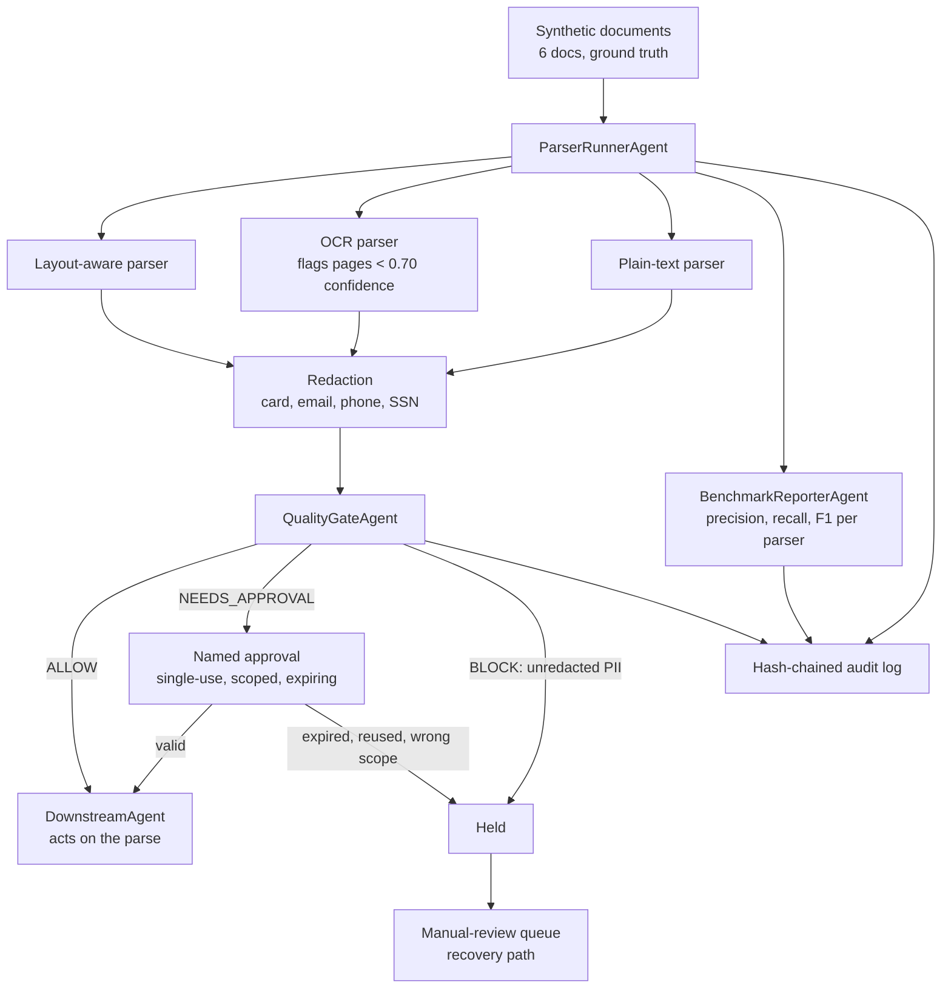
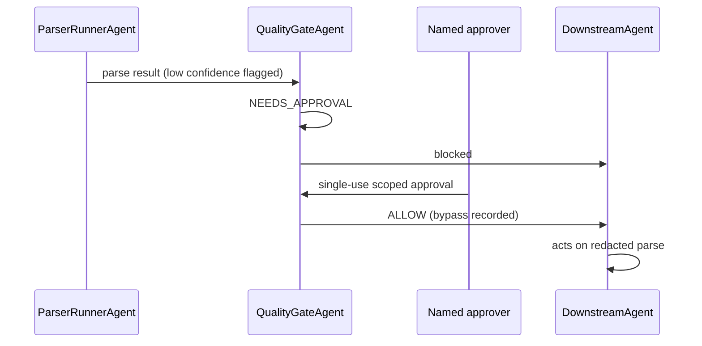

# Architecture

```mermaid
flowchart TD
    D[Synthetic documents\n6 docs, ground truth] --> R[ParserRunnerAgent]
    R --> L[Layout-aware parser]
    R --> O[OCR parser\nflags pages < 0.70 confidence]
    R --> P[Plain-text parser]
    L --> RED[Redaction\ncard, email, phone, SSN]
    O --> RED
    P --> RED
    RED --> G[QualityGateAgent]
    G -->|ALLOW| DOWN[DownstreamAgent\nacts on the parse]
    G -->|NEEDS_APPROVAL| APP[Named approval\nsingle-use, scoped, expiring]
    APP -->|valid| DOWN
    APP -->|expired, reused, wrong scope| HOLD[Held]
    G -->|BLOCK: unredacted PII| HOLD
    HOLD --> Q[Manual-review queue\nrecovery path]
    R --> REP[BenchmarkReporterAgent\nprecision, recall, F1 per parser]
    G --> AUD[Hash-chained audit log]
    R --> AUD
    REP --> AUD
```

```mermaid
sequenceDiagram
    participant Runner as ParserRunnerAgent
    participant Gate as QualityGateAgent
    participant Human as Named approver
    participant Down as DownstreamAgent
    Runner->>Gate: parse result (low confidence flagged)
    Gate->>Gate: NEEDS_APPROVAL
    Gate->>Down: blocked
    Human->>Gate: single-use scoped approval
    Gate->>Down: ALLOW (bypass recorded)
    Down->>Down: acts on redacted parse
```
